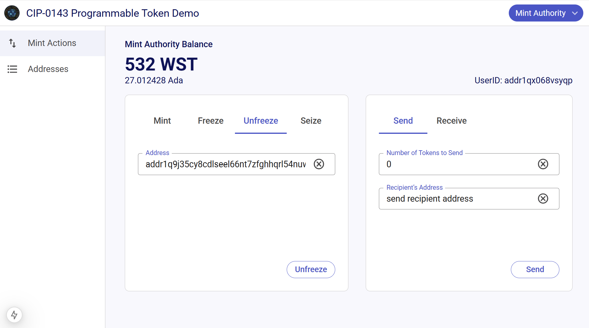

# CIP-143 reference implementation and examples

This repository contains a reference implementation of [CIP-143](https://github.com/colll78/CIPs/blob/patch-3/CIP-0143/README.md).
The CIP describes a registry of token standards around programmable assets, and some conventions for Cardano addresses that hold programmable assets.

## CLI

`cip-143-cli` is a tool for registering CIP-143 policies and for issuing and transfering tokens.

### CLI Commands

* `deploy` deploys a new instance of the CIP-143 registry
* `policy` offers a number of commands for managing CIP-143 policies. All sub-commands of `policy` require a blueprint JSON file with the minting and transfer scripts.
  * `register` registers the stake scripts that are used by the policy
  * `issue` mints a number of programmable assets
  * `transfer` sends programmable assets to another account
  * `info` prints some information on the policies

### Blueprint format

The `policy` command expectes a blueprint JSON file.
The blueprint should have two validators called `transfer.issue.withdraw` and `transfer.transfer.withdraw`.
The validators will be called as reward withdrawal validators.

## Freeze-and-seize stablecoin

There is a proof-of-concept for _WST_ a programmable token with freeze and seize capabilities, based on [CIP-0143](https://github.com/colll78/CIPs/blob/patch-3/CIP-0143/README.md). The programmable logic of _WST_ checks whether the target address is blacklisted before allowing a transfer of the programmable token from one owner to another.



## Demos and Integrations

* [Video](https://drive.google.com/file/d/1mRX4P-eGBTbKfGegTVLlBya_zGTAFNVa/view?usp=sharing) of the demo
* Check out [this video](https://docs.fluidtokens.com/DemoWST.mp4) to see the WST token being used in the [FluidTokens](https://fluidtokens.com/) protocol!
* Check out [this development build of Lace](https://github.com/input-output-hk/lace/compare/main...feat/programable-tokens-poc) that adds support for CIP-0143, incl. _WST_, to the wallet

# Architecture

See [doc/architecture.md](doc/architecture.md)

## Contents of this repository

This repository contains 
* Prototype implementation of CIP-0143 in Plutarch (see `src/programmable-tokens`)
* `cip-143-cli`, a command-line tool for deploying and managing CIP-143 compliant policies
* Prototype implementation of _WST_, a programmable token with freeze-and-seize capbilities, in Plutarch (see `src/regulated-stablecoin`)
  * Transaction building code for initial deployment, minting programmable tokens, transferring programmable tokens, adding addresses to the blacklist (ie. freezing), and seizing funds from blacklisted addresses. Based on sc-tools and cardano-api.
  * Emulator tests for the nominal cases (happy path) based on the actual ledger implementation and mainnet protocol parameters.
  * A user interface that implements the use cases using browser-based wallets. Based on next.js and lucid.
  * An OCI container image with the on-chain code, the off-chain code and the UI

### Using the Freeze-and-seize stablecoin example

With the container image it is possible to run the complete system locally with just a single command.
There is no need to install the build toolchain or to operate a cardano node or related infrastructure.
The image can even be used to interact with existing deployments of the POC.

The easiest way to get started is by running the [wst](https://github.com/input-output-hk/wsc-poc/pkgs/container/wst) image locally:

```bash
docker run --rm -p 8080:8080 --env WST_BLOCKFROST_TOKEN=previewXYZ ghcr.io/input-output-hk/wst:pr-67 manage 08a8d0bb8717839931b0a594f7c28b0a3b7c78f6e9172e977e250eab7637d879.0 start
```

Then open [localhost:8080/mint-authority.html](localhost:8080/mint-authority.html) in the browser.

Some notes
1. `podman` or others can be used instead of `docker`
2. `previewXYZ` must be replaced by a valid [blockfrost token](https://docs.blockfrost.io/#description/tokens) for the preview network
3. The tag `pr-67` corresponds to PR 67
4. `08a8d0bb8717839931b0a594f7c28b0a3b7c78f6e9172e977e250eab7637d879.0` is the transaction input that was used to initialise the deployment on the preview network.

# Contributing

## Backend

* Run the tests with `cabal test all`
* Enter the nix shell with `nix develop`

## Frontend

```bash
cd frontend
npm install
npm run dev
```

[!IMPORTANT]
Please make sure that the UI can be exported to a set of static assets.
This is necessary for the OCI image.
In particular, the command `npm run export` should succeed.

## Issues

Check out [the issue tracker](https://github.com/input-output-hk/wsc-poc/issues)

Bug reports and contributions are welcome!