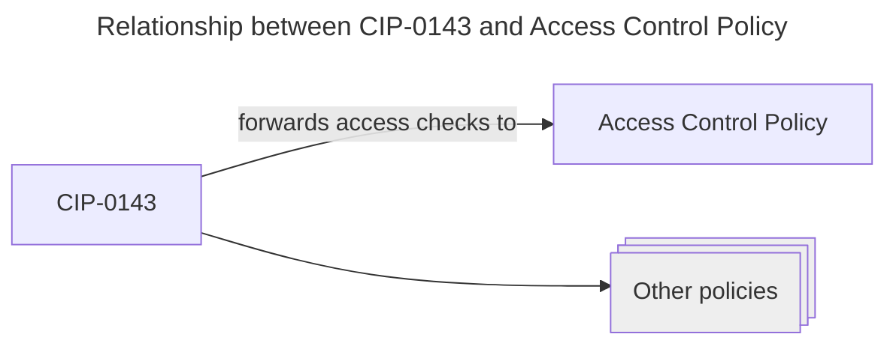

# System Design

This document describes the design of the regulated stablecoin proof-of-concept (POC).

## Overview

The POC consists of two components that make up the functionality of the regulated stablecoin.
The first component is [CIP-0143](https://github.com/colll78/CIPs/tree/patch-3/CIP-0143), which gives us a unified standard for managing different _programmable tokens_, comparable to some of the popular ERC standards on Ethereum.

The second component is a concrete instance of such a programmable token, namely a policy that checks each transfer of tokens in its domain to ensure that the sender is not on a list of sanctioned addresses.
The policy also allows the issuer of the programmable token to seize funds from sanctioned addresses.
We will call this policy the Access Control Policy (ACP).

### CIP-0143

At its core, CIP-0143 describes a registry of programmable token policies and a mechanism for finding the right script whenever one of the programmable tokens is minted, burned, or transferred to another user.

CIP-0143 supports a wide range of programmable token policies, including non-financial ones such as royalty collection schemes for NFTs.

### Contents of this repository

TOOD: Move to readme

This repository contains 
* Prototype implementation of CIP-0143 in Plutarch
* Prototype implementation of Access Control Policy in Plutarch
* Transaction building code for initial deployment, minting programmable tokens, transferring programmable tokens, adding addresses to the blacklist (ie. freezing), and seizing funds from blacklisted addresses. Based on sc-tools and cardano-api.
* Emulator tests for the nominal cases (happy path) based on the actual ledger implementation and mainnet protocol parameters.
* A user interface that implements the use cases using browser-based wallets. Based on next.js and lucid.
* An OCI container image with the on-chain code, the off-chain code and the UI

With the container image it is possible to run the complete system locally with just a single command.
There is no need to install the build toolchain or to operate a cardano node or related infrastructure.
The image can even be used to interact with existing deployments of the POC.

TODO: Instructions for running the POC locally.

## High-Level Interactions

## On-Chain Scripts

For each of the two components (CIP and ACP) there is a principal validation script that encodes the script's logic and vetoes any transaction that does not meet the specification.
The principal validation scripts use the [stake validator design pattern](https://github.com/Anastasia-Labs/design-patterns/blob/main/stake-validator/STAKE-VALIDATOR.md).

* CIP related
* Policy related

### Performance

### Complexity

### Yielding Patterns

* Sequence diagrams explaining which script yields to what

## Off-Chain

### Docker Image, Deployment

### Blockfrost

### Lifecycle

* 2 phases: Deployment, operations

Each of the two components (programmable tokens, regulated stablecoin) requires an initial transaction that creates the on-chain data which is referenced on every interaction with the programmable tokens.
The initial transaction creates the registry nodes and mints the NFTs that are used to prove authenticity to the on-chain scripts.
In the POC, the initialisation procedures for programmable tokens and for the regulated stablecoin are contained in a single transaction.

### Security

The deployment phase relies exclusively on the command-line (CLI).
It builds a 
It does not use the web interface.
Therefre

## Limitations of POC