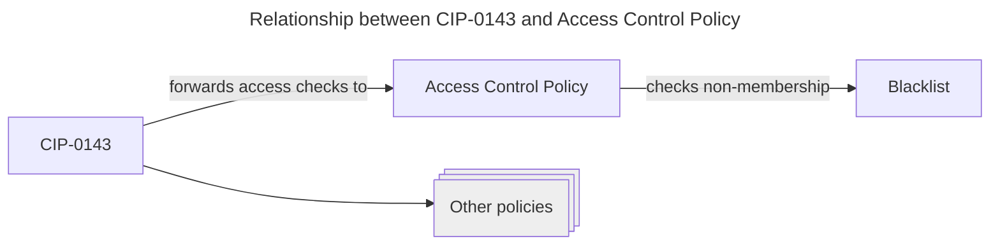
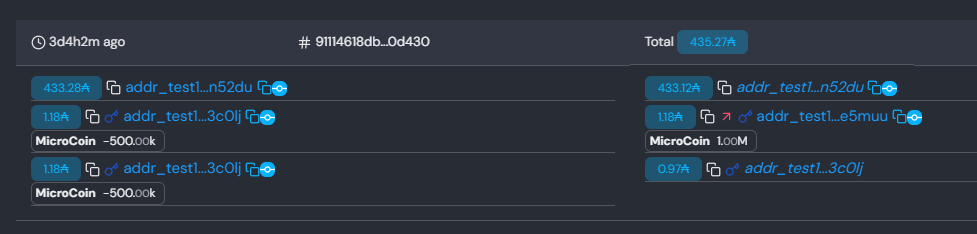

# System Design

This document describes the design of the regulated stablecoin proof-of-concept (POC).

## Overview

The POC consists of two components that make up the functionality of the regulated stablecoin.
The first component is [CIP-0143](https://github.com/colll78/CIPs/tree/patch-3/CIP-0143), which gives us a unified standard for managing different _programmable tokens_, comparable to some of the popular ERC standards on Ethereum.

The second component is a concrete instance of such a programmable token, namely a policy that checks each transfer of tokens in its domain to ensure that the sender is not on a list of sanctioned addresses.
The policy also allows the issuer of the programmable token to seize funds from sanctioned addresses.
We will call this policy the Access Control Policy (ACP).

### CIP-0143

At its core, CIP-0143 describes a registry of programmable token policies and a mechanism for finding the right script whenever one of the programmable tokens is minted, burned, or transferred to another user.

CIP-0143 supports a wide range of programmable token policies, including non-financial ones such as royalty collection schemes for NFTs.

### Access Control Policy (ACP)

This is the programmable token policy that we use to enable freeze and seize features.
When the policy is invoked, it examines the spending transaction to ensure that none of the signatures on the transaction are blacklisted.
The blacklist is stored as a sorted linked list on-chain.
Each entry has its own UTxO.
The UTxO also stores the next entry.
This makes it possible to check membership and non-membership in constant time (in the size of the list).


## High-Level Interactions

## On-Chain Scripts

For each of the two components (CIP and ACP) there is a principal validation script that encodes the script's logic and vetoes any transaction that does not meet the specification.
The principal validation scripts use the [stake validator design pattern](https://github.com/Anastasia-Labs/design-patterns/blob/main/stake-validator/STAKE-VALIDATOR.md).

The following table lists the main scripts and their purposes.

|Plutarch definition name|Used by|Parameters|Redeemer|Description|
|--|--|--|--|--|
|`mkPermissionedTransfer`|ACP|`permissionedCred`||Checks that the transaction was signed by the `permissionedCred` payment credential|
|`mkFreezeAndSeizeTransfer`|ACP|`programmableLogicBaseCred`, `blacklistNodeCS`|`proofs`|Checks that the transaction spends an output locked by `programmableLogicBaseCred`, and that none of the transaction's witnesses are in the blacklist with root `blacklistNodeCS`. For each witness a proof must be provided in `proofs`|
|`mkProgrammableLogicMinting`|CIP|`programmableLogicBase`, `nodeCS`, `mintingLogicCred`|`mintingAction`|Handles minting policy registration, and issuance / burning of programmable tokens.|
|`mkProgrammableLogicBase`|CIP|`stakeCred`|/|Validator script that locks progammable token outputs. Forwards all validation logic to the "global" programmable logic stake script `stakeCred`|
|`mkProgrammableLogicGlobal`|CIP|`protocolParamsCS`||The global programmable logic stake script. For each programmable token that is transferred/minted/burned, check that the corresponding programmable token logic is invoked.|
|`mkProtocolParametersMinting`|CIP|`oref`||Protocol parameters minting policy. Creates the NFT that marks the protocol parameters output. Checks that `oref` is spent (making this a one-shot minting policy)|

### Example Transaction

To help understand how the scripts work together, let's look at a CIP-0143 compliant transaction that transfers programmable tokens under the ACP from one user to another.
This transaction [91114618db866cc79b70129140e44e7195640a32bacca752f8f4b7a65590d430](https://preview.cexplorer.io/tx/91114618db866cc79b70129140e44e7195640a32bacca752f8f4b7a65590d430) was added to the preview testnet on Jan. 14.

We can open [preview.cexplorer.io](https://preview.cexplorer.io/tx/91114618db866cc79b70129140e44e7195640a32bacca752f8f4b7a65590d430) to examine the transaction in detail.
It has 3 inputs and 3 outputs.
The screenshot below shows inputs on the left and outputs on the right.



Three different Plutus scripts are invoked:
The global programmable logic stake script (`mkProgrammableLogicGlobal`), the POC transfer policy stake script (`mkFreezeAndSeizeTransfer`), and the programmabe logic base validator script (`mkProgrammableLogicBase`).

#### Inputs and outputs

The first input, `n52du`, contains only Ada.
Looking at the outputs, we can see that most of the original Ada is paid back to the same address `n52du`.
The difference is the Ada that was used to cover the transaction fee.

Then there are two inputs from a script address (indicated by the key sign) `3cOlj`.
This is the programmable logic base validator script.
The script succeeds because the transaction also invokes the global programmable logic stake script.
Each of those UTxO inputs contains 500k `MicroCoin`s.
This is the name of the regulated token that we used for this test.

In the outputs column on the right-hand side we can see that there are two script outputs.
The first script output is addressed to `e5muu` and the second to `3cOlj`.
The addresses have the same payment credential (the programmable logic base validator), but different stake credentials (`3cOlj` has the stake credential that identifies the sender, and `e5muu` has the stake credential that identifies the recipient).
The sum of 1M `MicroCoin`s has been sent to `e5muu`, which means that they are now under the control of the recipient.

#### Scripts

Looking at the `Contracts` tab we can see that there were four invocations of Plutus scripts.


Two with purpose `SPEND` and two with purpose `REWARD`.
The `SPEND` invocations correspond to the two script inputs from the `3cOlj` address.
Both of them simply make sure that the global programmable logic stake script runs in the same transaction.
This is why the two `SPEND` script runs consume very few resources (Mem and Steps), and contribute 0.00 Ada to the transaction's script fees.

The two `REWARD` script invocations are the ones that run the actual business logic.
We can distinguish them by their redeemers.

##### Stake validator 1: Programmable Logic (CIP)

The redeemer of the first entry is `{"fields": [{"list": [{"fields": [{"int": 2}], "constructor": 0}]}], "constructor": 0}`.
Applying our knowledge of the data encoding we can tell that this redeemer corresponds to the first constructor of `PProgrammableLogicGlobalRedeemer`,`PTransferAct`.

```haskell

data PProgrammableLogicGlobalRedeemer (s :: S)
  = PTransferAct
      ( Term s ( PDataRecord '[ "proofs" ':= PBuiltinList (PAsData PTokenProof) ] ) )
  -- | PSeizeAct
  --     ( ...
  --     )
  deriving stock (Generic)
  deriving anyclass (PlutusType, PIsData, PEq)
```

This means that we are looking at the programmable logic base script.
The redeemer contains a list of proofs in the form of pointers into the list of reference inputs used by the transaction.
There is one proof for each type of programmable token touched by the transaction.

The value `2` tells the global programmable logic validator to check the second reference input for a stake credential, and to verify that the referenced stake validator is run as part of this transaction.

So we could say that the global programmable logic validator "de-references a pointer" to the ACP stake credential.


##### Stake validator 2: Access Control Policy (ACP)

The second stake validator implements the actual policy that governs the spending of `MicroCoin`s.
This redeemer of this validator is a list of `PBlacklistProof` values.

```haskell
data PBlacklistProof (s :: S)
  = PNonmembershipProof
      ( Term
          s
          ( PDataRecord
              '[ "nodeIdx" ':= PInteger
               ]
          )
      )
  deriving stock (Generic)
  deriving anyclass (PlutusType, PIsData, PEq, PShow)
```

Each `PBlacklistProof` is a pointer into the list of reference inputs.
The UTxO of the reference input is an entry in the linked list that contains the blacklisted credentials.
The script needs to check that the sender of the funds is not blacklisted, and it does so by looking at the "covering entry" in the list -- the entry that _would_ contain the sender's credential if it _was_ blacklisted.

## Off-Chain

The system is designed so that all actions except the initial deployment of the programmable logic UTxOs can be performed through a web UI with browser-based wallets. The REST API therefore exposes a number of endpoints that produce fully-balanced-but-not-signed transactions. The intention is for the caller (web UI) to sign the transactions with the web-based wallet and submit them to the network. The backend uses blockfrost to query the blockchain. As a result, the server is pretty light-weight and does not even need its own database or a full cardano node.

### Docker Image, Deployment

A CD pipeline builds a docker image that bundles the frontend and the backend, and pushes it to the github container registry.
As a result, it is very easy to run the entire system locally.

### Lifecycle

Both components, CIP and ACP, require an initial transaction that creates the on-chain data which is referenced on every interaction with the programmable tokens.
The initial transaction creates the registry nodes and mints the NFTs that are used to prove authenticity to the on-chain scripts.
In the POC, the initialisation procedures for programmable tokens (CIP) and for the regulated stablecoin (ACP) are merged in a single transaction.
This means that the entire system can be deployed in a single step.

### Security

The deployment phase relies exclusively on the command-line (CLI).
This is the only time when our code handles private keys.

After the initial deployment, the private keys can be removed from the system.
All future transactions can be signed by a web wallet.

Therefore, there is no need to store private keys during the regular operation of the system.

## Limitations of POC

The POC works on the *preview testnet*.
The code in this repository has not been audited.
A professional audit is highly recommended before using this code in a production setting.

# FAQs

## How is this system different from Djed?

Djed is an algorithmic stablecoin that is backed by Ada. In Djed we keep the entire reserves of the stablecoin in a UTxO that is controlled by the Djed contract. Every user of Djed can verify that the reserves exist and that there is enough Ada to pay out all Djed holders.

This POC implements a _fiat-backed stablecoin_. This means that the reserves exist in a bank account outside of the blockchain, and we have to trust the issuer of the stablecoin that every token that's been issued on-chain is backed by one USD in the bank account.

From a technical perspective, not having to manage the reserve on-chain makes the design of this POC somewhat simpler: We don't need to maintain a global state (the Djed UTxO) that all orders have to synchronise with. The challenge in this POC lies in the programmable token logic.

## How does the system scale?

The core idea of the regulated stablecoin is to run a check every time the owner of some amount of regulated tokens changes. This check is performed by the _transfer logic script_, a plutus program that consults a list of sanctioned addresses to ensure that the receiving address is not on it. 

The list of sanctioned addresses is the only data structure that (a) needs to be read from by every transaction of the transfer logic script and (b) gets changed regularly during the operation of the stablecoin.

All other factors (number of scripts, script budget, max. number of transfer checks per transaction and so forth) are fixed and do not depend on the number of users.

It is important to note that the list of sanctioned addresses scales in space (number of UTxOs), but working with the data structure is done in constant time due to the way the data is laid out.

There is also no risk of UTxO congestion as the "system outputs" are used as reference inputs and not spent by user-to-user transfers. Each user-to-user transfer is processed independently.

### Sanctioned Addresses

The list of sanctioned addresses is stored on-chain as a [_linked list_](https://github.com/Anastasia-Labs/plutarch-linked-list). This means that each entry (address) in the list is represented as a single transaction output that includes the address itself as well as a pointer to the next address in lexicographical order.

When checking a transfer, the transfer logic script is provided with a single reference input containing the relevant entry in the ordered linked list. 

The transfer transaction does not spend the linked list output, therefore the same linked list output can be used by many transactions in the same block and across multiple blocks.

#### How many sanctioned addresses are there?

Publicly available data on Tether (the largest fiat stablecoin) indicates that Tether has a total of [1990 sanctioned addresses](https://dune.com/phabc/usdt---banned-addresses), out of [109 million on-chain wallets](https://tether.io/news/how-many-usdt-on-chain-holders-are-there/) (Dec. 2024). This suggests that about 0.002 percent of addresses need to be blacklisted.

If our system achieved the scale of Tether then we would need about 1200 UTxOs to store the linked list. At current Ada prices this would amount to 1800 USD in min Ada UTxO deposits, an amount that will be refunded in its entirety when the linked list is deleted.

USDC, another fiat-stablecoin, currently has [264 blacklisted addresses](https://bloxy.info/txs/events_sc/0xa0b86991c6218b36c1d19d4a2e9eb0ce3606eb48?signature_id=257159) and 3m users, with a blacklist ratio of about 0.009 percent.
