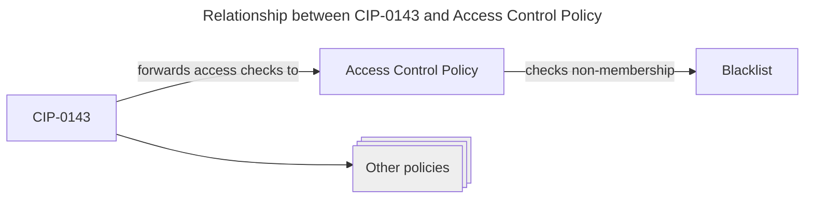
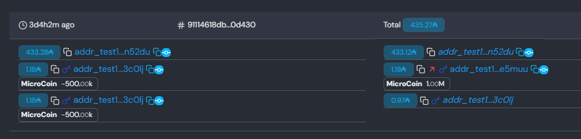

# System Design

This document describes the design of the regulated stablecoin proof-of-concept (POC).
For the core programmable-token mini-ledger contracts only, see [mini-ledger-architecture.md](mini-ledger-architecture.md).

## Overview

The POC consists of two components that make up the functionality of the regulated stablecoin.
The first component is [CIP-0143](https://github.com/cardano-foundation/CIPs/tree/master/CIP-0143), which gives us a unified standard for managing different _programmable tokens_, comparable to some of the popular ERC standards on Ethereum.

The second component is a concrete instance of such a programmable token, namely a policy that checks each transfer of tokens in its domain to ensure that the owners/witnesses required to spend the programmable-token inputs are not on a list of sanctioned addresses.
The policy also allows the issuer of the programmable token to seize funds from sanctioned addresses.
We will call this policy the Access Control Policy (ACP).

### CIP-0143

At its core, CIP-0143 describes a registry of programmable token policies and a mechanism for finding the right script whenever one of the programmable tokens is minted, burned, or transferred to another user.

CIP-0143 supports a wide range of programmable token policies, including non-financial ones such as royalty collection schemes for NFTs.

### Access Control Policy (ACP)

This is the programmable token policy that we use to enable freeze and seize features.
When the policy is invoked, it examines the spending transaction to ensure that none of the required owners/witnesses for the programmable-token inputs are blacklisted.
The blacklist is stored as a sorted linked list on-chain.
Each entry has its own UTxO.
The UTxO also stores the next entry.
This makes it possible to check membership and non-membership in constant time with respect to the length of the list, provided the covering entry is supplied as a reference input.


```mermaid
---
title: Relationship between CIP-0143 and Access Control Policy
---

flowchart LR
  cip[CIP-0143]

  policy[Access Control Policy]
  blacklist[Blacklist]

  other_policies@{shape: procs, label: "Other policies"}
  style other_policies fill:#eee;

  cip -->|forwards access checks to| policy
  policy -->|checks non-membership| blacklist
  cip --> other_policies
```
## High-Level Interactions

The current implementation supports the following lifecycle:

1. The off-chain library can deploy the CIP-0143 registry, protocol parameters, blacklist state, and script registrations in a single transaction.
2. The currently exposed browser flow performs the issuer setup incrementally through separate "Register Asset" and "Initialize Blacklist" actions.
3. Issuance mints programmable tokens into the programmable-logic mini-ledger at an address derived from the recipient payment credential.
4. Ordinary transfers spend mini-ledger outputs, invoke the global programmable logic script, and invoke the ACP transfer script to prove that the required owners/witnesses are not blacklisted.
5. Freeze and unfreeze operations insert or remove nodes from the on-chain blacklist linked list.
6. Seize operations perform an issuer-authorized third-party transfer from sanctioned credentials; the current API also supports multi-seize.

## On-Chain Scripts

For each of the two components (CIP and ACP) there is a principal validation script that encodes the script's logic and vetoes any transaction that does not meet the specification.
The principal validation scripts use the [stake validator design pattern](https://github.com/Anastasia-Labs/design-patterns/blob/main/stake-validator/STAKE-VALIDATOR.md).

The following table lists the main scripts and their purposes.

|Plutarch definition name|Used by|Parameters|Redeemer|Description|
|--|--|--|--|--|
|`mkDirectoryNodeMP`|CIP|`initUTxO`, `issuanceCborHexCS`|`InitDirectory \| InsertDirectoryNode`|Maintains the linked-list directory of registered programmable-token policies.|
|`pmkDirectorySpending`|CIP|`protocolParamsCS`|/|Validates spending of directory nodes against the protocol-parameters NFT.|
|`mkProgrammableLogicMinting`|CIP|`programmableLogicBase`, `mintingLogicCred`|`mintingLogicCred`|Handles issuance and burning for a programmable-token policy instance. Requires the corresponding minting logic script to be invoked.|
|`mkProgrammableLogicBase`|CIP|`stakeCred`|/|Validator script that locks programmable token outputs. Forwards all validation logic to the "global" programmable logic stake script `stakeCred`|
|`mkProgrammableLogicGlobal`|CIP|`protocolParamsCS`|`TransferAct \| SeizeAct`|The global programmable logic stake script. `TransferAct` validates transfer/mint proofs against the directory and keeps programmable value inside the mini-ledger. `SeizeAct` validates issuer-authorized third-party transfers/seizures.|
|`mkProtocolParametersMinting`|CIP|`oref`||Protocol parameters minting policy. Creates the NFT that marks the protocol parameters output. Checks that `oref` is spent (making this a one-shot minting policy)|
|`mkIssuanceCborHexMinting`|CIP|`oref`|/|One-shot minting policy for the issuance CBOR-hex reference UTxO used by directory registration.|
|`mkFreezeAndSeizeTransfer`|ACP|`programmableLogicBaseCred`, `blacklistNodeCS`|`[BlacklistProof]`|Checks that the owners/witnesses required to spend programmable-token inputs are not blacklisted. Each proof points to a covering blacklist node supplied via reference inputs.|
|`mkPermissionedTransfer`|ACP support|`permissionedCred`|/|Checks that the transaction was signed by the required payment key hash. Used by the permissioned blacklist and issuer-side scripts.|

### Example Transaction

To help understand how the scripts work together, let's look at a CIP-0143 compliant transaction that transfers programmable tokens under the ACP from one user to another.
This transaction [91114618db866cc79b70129140e44e7195640a32bacca752f8f4b7a65590d430](https://preview.cexplorer.io/tx/91114618db866cc79b70129140e44e7195640a32bacca752f8f4b7a65590d430) was added to the preview testnet on Jan. 14.

We can open [preview.cexplorer.io](https://preview.cexplorer.io/tx/91114618db866cc79b70129140e44e7195640a32bacca752f8f4b7a65590d430) to examine the transaction in detail.
It has 3 inputs and 3 outputs.
The screenshot below shows inputs on the left and outputs on the right.



Three different Plutus scripts are invoked:
The global programmable logic stake script (`mkProgrammableLogicGlobal`), the POC transfer policy stake script (`mkFreezeAndSeizeTransfer`), and the programmable logic base validator script (`mkProgrammableLogicBase`).

#### Inputs and outputs

The first input, `n52du`, contains only Ada.
Looking at the outputs, we can see that most of the original Ada is paid back to the same address `n52du`.
The difference is the Ada that was used to cover the transaction fee.

Then there are two inputs from a script address (indicated by the key sign) `3cOlj`.
This is the programmable logic base validator script.
The script succeeds because the transaction also invokes the global programmable logic stake script.
Each of those UTxO inputs contains 500k `MicroCoin`s.
This is the name of the regulated token that we used for this test.

In the outputs column on the right-hand side we can see that there are two script outputs.
The first script output is addressed to `e5muu` and the second to `3cOlj`.
The addresses have the same payment credential (the programmable logic base validator), but different stake credentials (`3cOlj` has the stake credential that identifies the sender, and `e5muu` has the stake credential that identifies the recipient).
The sum of 1M `MicroCoin`s has been sent to `e5muu`, which means that they are now under the control of the recipient.

More generally, the programmable logic base behaves like a mini-ledger that lives on Cardano.
Every programmable-token UTxO uses the same payment credential, and ownership is represented by the staking credential attached to that UTxO.
When spending from this mini-ledger, the transaction must provide the witnesses associated with that staking credential.
As a result, the on-chain CIP layer does not try to prove that the destination staking credential is "sensible" or recoverable.
If a user signs a transaction that sends programmable tokens to a programmable-logic-base address with a random, unusable, or otherwise unwanted staking credential, those funds become self-locked inside the mini-ledger.
This is intentional and is analogous to sending ordinary Ada to an address whose spending keys nobody controls.
Wallet and off-chain transaction builders are therefore responsible for deriving the conventional destination staking credential for normal user-to-user transfers.

#### Scripts

Looking at the `Contracts` tab we can see that there were four invocations of Plutus scripts.


Two with purpose `SPEND` and two with purpose `REWARD`.
The `SPEND` invocations correspond to the two script inputs from the `3cOlj` address.
Both of them simply make sure that the global programmable logic stake script runs in the same transaction.
This is why the two `SPEND` script runs consume very few resources (Mem and Steps), and contribute 0.00 Ada to the transaction's script fees.

The two `REWARD` script invocations are the ones that run the actual business logic.
We can distinguish them by their redeemers.

##### Stake validator 1: Programmable Logic (CIP)

In the current implementation, ordinary transfers and mint/burn transactions use the `TransferAct` constructor of `ProgrammableLogicGlobalRedeemer`, while issuer-driven third-party transfers use `SeizeAct`.

`TransferAct` carries two proof lists:

1. `plgrTransferProofs`, which prove that each programmable token touched by the transaction is registered in the directory and that the corresponding transfer logic script is invoked.
2. `plgrMintProofs`, which are used only when programmable tokens are minted or burned.

For a plain user-to-user transfer such as the example above, the relevant information is the transfer-proof list. Each proof acts like a pointer into the reference-input set, allowing the global programmable logic validator to find the directory node for the token policy and verify that the corresponding stake script is invoked in the same transaction.


##### Stake validator 2: Access Control Policy (ACP)

The second stake validator implements the actual policy that governs the spending of `MicroCoin`s.
The redeemer of this validator is a list of `PBlacklistProof` values.

```haskell
data PBlacklistProof (s :: S)
  = PNonmembershipProof
      ( Term
          s
          ( PDataRecord
              '[ "nodeIdx" ':= PInteger
               ]
          )
      )
  deriving stock (Generic)
  deriving anyclass (PlutusType, PIsData, PEq, PShow)
```

Each `PBlacklistProof` points into the list of reference inputs.
The referenced UTxO is an entry in the linked list that contains blacklisted credentials.
The script extracts the owners/witnesses required to spend the programmable-token inputs and checks that each one is not blacklisted by looking at the corresponding "covering entry" in the list: the entry that _would_ contain that credential if it _was_ blacklisted.

## Off-Chain

The current implementation consists of a Servant backend and a Next.js frontend. The backend exposes query endpoints and transaction-building endpoints that return fully-balanced-but-not-signed transactions. The intended production-style flow is for the caller (typically a browser wallet) to sign those transactions client-side and submit them to the network.

The backend uses Blockfrost to query the blockchain and does not require a full Cardano node for these flows. Unlike the earliest version of the POC, the server now also keeps a small SQLite-backed metadata store that maps freeze/seize policy identifiers back to their issuer addresses so that later transactions can be built after a process restart.

### Docker Image, Deployment

A CD pipeline builds a docker image that bundles the frontend and the backend, and pushes it to the github container registry.
As a result, it is very easy to run the entire system locally.

### Lifecycle

Both components, CIP and ACP, require initial on-chain state that is referenced by later interactions with programmable tokens.

At the library level, the repository still supports a single-step deployment transaction that mints protocol parameters, initializes the directory, initializes the blacklist, registers the global programmable-logic script, and registers the issuer-specific transfer scripts.

At the currently exposed API/UI level, issuer setup is more incremental: the browser flow presents separate actions for registering the transfer scripts and initializing the blacklist, after which mint, transfer, freeze, unfreeze, and seize operations are available.

### Security

For normal transaction-building flows, the backend can operate without holding user private keys: it builds unsigned transactions and expects the wallet on the client side to sign and submit them.

However, the repository also contains a demo mode that serves a `demo-environment` payload with canned seed phrases and related metadata for local/demo accounts. The frontend can derive addresses from those mnemonics to populate the demo UI. That behavior is a demo convenience and should not be treated as the production security model.

## Limitations of POC

The checked-in demo environment targets the *preview* network by default, although the demo-environment format carries an explicit network value and the repository also contains generated artifacts for other networks.
The code in this repository has not been audited.
A professional audit is highly recommended before using this code in a production setting.

# FAQs

## How is this system different from Djed?

Djed is an algorithmic stablecoin that is backed by Ada. In Djed we keep the entire reserves of the stablecoin in a UTxO that is controlled by the Djed contract. Every user of Djed can verify that the reserves exist and that there is enough Ada to pay out all Djed holders.

This POC implements a _fiat-backed stablecoin_. This means that the reserves exist in a bank account outside of the blockchain, and we have to trust the issuer of the stablecoin that every token that's been issued on-chain is backed by one USD in the bank account.

From a technical perspective, not having to manage the reserve on-chain makes the design of this POC somewhat simpler: We don't need to maintain a global state (the Djed UTxO) that all orders have to synchronise with. The challenge in this POC lies in the programmable token logic.

## How does the system scale?

The core idea of the regulated stablecoin is to run a check every time the owner of some amount of regulated tokens changes. This check is performed by the _transfer logic script_, a plutus program that consults a list of sanctioned addresses to ensure that the required owners/witnesses of the programmable-token inputs are not on it.

The list of sanctioned addresses is the only data structure that (a) needs to be read from by every transaction of the transfer logic script and (b) gets changed regularly during the operation of the stablecoin.

All other factors (number of scripts, script budget, max. number of transfer checks per transaction and so forth) are fixed and do not depend on the number of users.

It is important to note that the list of sanctioned addresses scales in space (number of UTxOs), but working with the data structure is done in constant time due to the way the data is laid out.

There is also no risk of UTxO congestion as the "system outputs" are used as reference inputs and not spent by user-to-user transfers. Each user-to-user transfer is processed independently.

### Sanctioned Addresses

The list of sanctioned addresses is stored on-chain as a [_linked list_](https://github.com/Anastasia-Labs/plutarch-linked-list). This means that each entry (address) in the list is represented as a single transaction output that includes the address itself as well as a pointer to the next address in lexicographical order.

When checking a transfer, the transfer logic script is provided with one or more reference inputs containing the relevant covering entries in the ordered linked list.

The transfer transaction does not spend the linked list output, therefore the same linked list output can be used by many transactions in the same block and across multiple blocks.

#### How many sanctioned addresses are there?

Publicly available data on Tether (the largest fiat stablecoin) indicates that Tether has a total of [1990 sanctioned addresses](https://dune.com/phabc/usdt---banned-addresses), out of [109 million on-chain wallets](https://tether.io/news/how-many-usdt-on-chain-holders-are-there/) (Dec. 2024). This suggests that about 0.002 percent of addresses need to be blacklisted.

If our system achieved the scale of Tether then we would need about 1200 UTxOs to store the linked list. At current Ada prices this would amount to 1800 USD in min Ada UTxO deposits, an amount that will be refunded in its entirety when the linked list is deleted.

USDC, another fiat-stablecoin, currently has [264 blacklisted addresses](https://bloxy.info/txs/events_sc/0xa0b86991c6218b36c1d19d4a2e9eb0ce3606eb48?signature_id=257159) and 3m users, with a blacklist ratio of about 0.009 percent.
