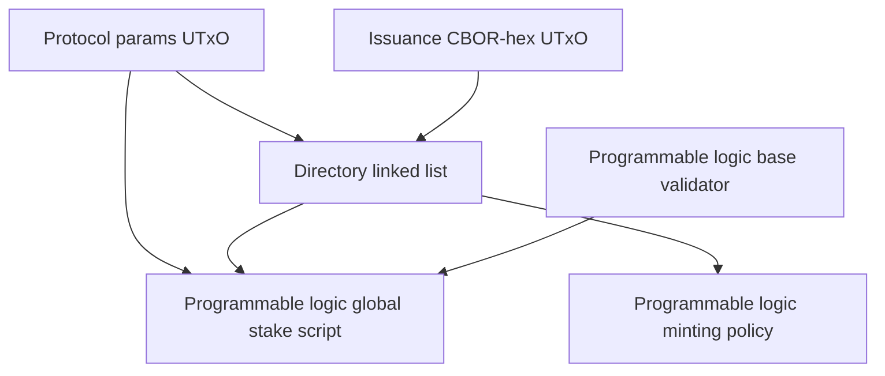

# Mini-Ledger Architecture

This document describes the core programmable-token on-chain architecture only.
It is intentionally limited to the generic mini-ledger and registry contracts that support issuance, transfer, burning, and issuer-authorized lifecycle operations for programmable tokens.

Validated against commit `0a9f8d69c34b82fcb6a65638449178cdbb059559`.

## Scope

Included modules:

- `SmartTokens.Contracts.ProtocolParams` (`src/programmable-tokens-onchain/lib/SmartTokens/Contracts/ProtocolParams.hs`)
- `SmartTokens.Contracts.IssuanceCborHex` (`src/programmable-tokens-onchain/lib/SmartTokens/Contracts/IssuanceCborHex.hs`)
- `SmartTokens.Contracts.Issuance` (`src/programmable-tokens-onchain/lib/SmartTokens/Contracts/Issuance.hs`)
- `SmartTokens.Contracts.ProgrammableLogicBase` (`src/programmable-tokens-onchain/lib/SmartTokens/Contracts/ProgrammableLogicBase.hs`)
- `SmartTokens.LinkedList.MintDirectory` (`src/programmable-tokens-onchain/lib/SmartTokens/LinkedList/MintDirectory.hs`)
- `SmartTokens.LinkedList.SpendDirectory` (`src/programmable-tokens-onchain/lib/SmartTokens/LinkedList/SpendDirectory.hs`)
- `SmartTokens.LinkedList.Common` (`src/programmable-tokens-onchain/lib/SmartTokens/LinkedList/Common.hs`)
- `SmartTokens.Types.PTokenDirectory` (`src/programmable-tokens-onchain/lib/SmartTokens/Types/PTokenDirectory.hs`)
- `SmartTokens.Types.ProtocolParams` (`src/programmable-tokens-onchain/lib/SmartTokens/Types/ProtocolParams.hs`)
- `SmartTokens.Types.Constants` (`src/programmable-tokens-onchain/lib/SmartTokens/Types/Constants.hs`)
- `Types.Constants` (`src/programmable-tokens-onchain/lib/Types/Constants.hs`)

Excluded modules:

- `SmartTokens.Contracts.ExampleTransferLogic`
- `SmartTokens.LinkedList.MintBlacklist`
- `SmartTokens.LinkedList.SpendBlacklist`
- `SmartTokens.LinkedList.BlacklistCommon`
- All example programmable-token substandards, including freeze/seize-specific policy logic
- All off-chain code

## Purpose

The mini-ledger is the generic on-chain substrate for programmable tokens.
Its job is to:

1. Register programmable-token policy instances in an on-chain directory keyed by programmable token currency symbol.
2. Anchor global parameters that tell the system which directory instance and programmable-token base credential are authoritative.
3. Keep programmable-token value inside a common script-controlled address space.
4. Require that token-specific transfer logic and issuer logic be invoked when programmable assets move or are minted/burned.

In this design, the core contracts do not implement any one programmable-token policy.
Instead, they route enforcement to token-specific transfer and issuer logic credentials stored in the directory.

## High-Level Model

The architecture is split into four layers:

1. Bootstrap anchors: one-shot NFTs and immutable reference UTxOs.
2. Directory registry: a linked list of programmable-token registrations.
3. Mini-ledger base validator: the common payment credential that holds programmable-token outputs.
4. Global programmable logic: the stake-script layer that validates transfer, mint/burn, and issuer-authorized third-party flows.

## State Objects And Control Assets

| Object | Contract owner | Control asset | Datum | Purpose |
|--|--|--|--|--|
| Protocol parameters UTxO | `alwaysFailScript` anchor | `ProtocolParams` NFT | `ProgrammableLogicGlobalParams` | Publishes the authoritative directory currency symbol and programmable logic base credential. |
| Issuance CBOR-hex UTxO | `alwaysFailScript` anchor | `IssuanceCborHex` NFT | `IssuanceCborHex` | Publishes script-byte prefix/postfix data used to validate directory registrations. |
| Directory node UTxO | directory spending validator | one directory-node token under `directoryNodeCS` | `DirectorySetNode` | Stores one sorted linked-list entry keyed by programmable token currency symbol. |
| Programmable token UTxO | programmable logic base validator | programmable token assets | address stake credential identifies owner | Holds user balances inside the mini-ledger under a common payment credential. |

### Protocol Parameters

`ProgrammableLogicGlobalParams` contains:

- `directoryNodeCS`: the currency symbol of the directory node minting policy in `SmartTokens.Types.ProtocolParams`.
- `progLogicCred`: the payment credential of the programmable logic base validator in `SmartTokens.Types.ProtocolParams`.

The global stake script and directory spending script both locate this datum by finding the reference input that carries the `ProtocolParams` NFT.

### Issuance CBOR-Hex Anchor

`IssuanceCborHex` contains:

- `prefixCborHex`
- `postfixCborHex`

The directory insertion path uses these bytes to recompute the expected programmable-token currency symbol for a registration candidate.
This makes registration depend on an authenticated script template rather than on an arbitrary off-chain claim.

### Directory Node Datum

`DirectorySetNode` stores:

- `key`: the registered programmable-token currency symbol
- `next`: the next currency symbol in lexical order
- `transferLogicScript`: the credential that must validate ordinary transfers
- `issuerLogicScript`: the credential that must validate issuer-authorized lifecycle actions
- `globalStateCS`: an optional token-specific state anchor

The linked list uses a sentinel origin/head node with empty key data and a sentinel tail key of all `ff`.

## Contract Set

### 1. Bootstrap Anchors

#### `mkProtocolParametersMinting`

This is a one-shot minting policy.
It mints exactly one token named `ProtocolParams` and requires consumption of the configured bootstrap `TxOutRef`.

Architecturally, this NFT is the discovery anchor for the rest of the mini-ledger.

#### `mkIssuanceCborHexMinting`

This is another one-shot minting policy.
It mints exactly one token named `IssuanceCborHex` and requires consumption of its own bootstrap `TxOutRef`.

Architecturally, this UTxO is not user state.
It is immutable reference data used to authenticate directory registrations.

#### `alwaysFailScript`

The spending side of the protocol-parameter and issuance-reference anchors is intentionally unspendable.
The pattern is: mint a unique NFT into a dedicated UTxO and then rely on that UTxO as immutable reference data.

### 2. Directory Registry

#### `mkDirectoryNodeMP`

This minting policy maintains the registration directory.
It has two redeemers:

- `InitDirectory`
- `InsertDirectoryNode CurrencySymbol ScriptHash`

`InitDirectory` creates the sentinel node and mints the origin directory-node token.
`InsertDirectoryNode` consumes exactly one covering node, updates that node so its `next` points at the new key, creates a new node for the inserted programmable token, and mints a new directory-node token whose token name equals the inserted key.

#### `makeCommon`, `pInit`, and `pInsert`

`SmartTokens.LinkedList.Common` centralizes the directory validation logic.
The important architectural rules are:

1. Directory-node outputs are recognized by the presence of the directory minting policy currency symbol in their value.
2. Every node output must contain exactly one node token plus Ada.
3. The directory is kept lexicographically ordered by `key < next`.
4. `Init` must create exactly one empty sentinel node and must not spend any prior node.
5. `Insert` must spend exactly one covering node and produce:
   - one updated covering node
   - one inserted node
   - exactly one newly minted node token whose token name is the inserted key

#### Registration Authenticity

`pInsert` does more than linked-list maintenance.
It also verifies that the inserted key is a valid programmable-token registration.

The registration proof is:

1. Find the `IssuanceCborHex` reference input.
2. Read `prefixCborHex` and `postfixCborHex`.
3. Serialize the hashed parameter supplied in the registration transaction.
4. Recompute the expected script hash / currency symbol.
5. Require that:
   - the recomputed currency symbol equals `keyToInsert`
   - the transaction mints under that currency symbol

This is the core authenticity check tying a directory entry to a real programmable-token policy instance.
The inserted node itself still supplies the transfer-logic credential, issuer-logic credential, and optional `globalStateCS` that the global validator will enforce later.

#### `pmkDirectorySpending`

Directory nodes are not freely spendable.
Their spending validator requires a reference input carrying the protocol-parameters NFT and then checks that the current transaction mints under `directoryNodeCS`.

Architecturally, this means a directory-node spend is only valid as part of a directory-maintenance transaction driven by the directory minting policy itself.

`pmkDirectorySpendingYielding` and `pmkDirectoryGlobalLogic` are auxiliary variants exported from the same module, but the standard compiled script set uses `pmkDirectorySpending`.

### 3. Programmable Token Mint/Burn Policy

#### `mkProgrammableLogicMinting`

This minting policy governs issuance and burning for a single registered programmable-token policy instance.

Its parameters are:

- the programmable logic base payment credential
- the minting-logic script hash that must authorize mint/burn for this token instance

Its architecture is intentionally minimal:

1. It looks only at tokens under its own currency symbol.
2. It currently assumes one token name per programmable-token policy instance.
3. On mint:
   - the first transaction output must contain the minted quantity
   - that first output must be locked by the programmable logic base credential
   - the token’s minting logic script must be invoked as a withdrawal
   - exactly one mint redeemer matching that script credential must appear
4. On burn:
   - the same minting logic script must be invoked
   - the matching mint redeemer uniqueness check still applies

The policy does not itself look up the directory.
The directory registration step is what binds a programmable-token currency symbol to the transfer and issuer logic credentials that the global validator will later require.

### 4. Programmable Logic Base Validator

#### `mkProgrammableLogicBase`

This is the common payment validator for all programmable-token UTxOs.
It does not enforce token-specific business rules directly.

Its single architectural responsibility is to ensure that the configured programmable-logic global stake credential is invoked in the same transaction via the withdraw-zero pattern.

That makes the base validator the entry point into the mini-ledger, while the stake script performs the semantic checks.

## Global Programmable Logic

### Inputs To The Global Validator

`mkProgrammableLogicGlobal` is parameterized by `protocolParamsCS`, not by token-specific policy data.
At runtime it:

1. Locates the protocol-parameters UTxO from reference inputs.
2. Reads `directoryNodeCS` and `progLogicCred`.
3. Reads the transaction’s withdrawals, signatories, inputs, outputs, mint field, and redeemers.

This makes the global validator the place where generic mini-ledger invariants are enforced.

### `TransferAct`

`TransferAct` contains:

- `plgrTransferProofs`
- `plgrMintProofs`

The transfer path proceeds conceptually as follows:

1. Aggregate all non-Ada value currently spendable from programmable-token base inputs at `progLogicCred`.
2. Treat ownership as an address property:
   - if the staking credential is a pubkey, that key must sign
   - if the staking credential is a script, that script must be invoked in withdrawals
3. Filter that aggregated value into programmable and non-programmable currency symbols using one directory proof per currency-symbol entry.
4. For each programmable currency symbol, require that the registered transfer logic script is invoked.
5. If the tx also mints or burns, validate the programmable subset of the mint field using `plgrMintProofs`.
6. Compute the expected programmable value after applying mint/burn deltas.
7. Require that outputs locked by `progLogicCred` contain at least that expected programmable value.

This is the heart of the mini-ledger:

- programmable tokens are allowed to move between outputs at the common base credential
- non-programmable assets are ignored by the programmable-token proof system
- programmable-token value is not allowed to escape the mini-ledger

### `SeizeAct`

`SeizeAct` is the generic issuer-authorized third-party transfer branch.
It is part of the core mini-ledger because it provides the generic issuer-side path; individual substandards decide when and why their issuer logic script should allow it.

Its redeemer identifies:

- the directory node for the target programmable token
- a list of relative input indexes
- the output slice where corresponding programmable outputs begin
- the declared count of indexed inputs

The branch enforces:

1. The referenced directory node is authentic.
2. The token-specific `issuerLogicScript` from that directory node is invoked.
3. The indexed input set is well formed, and the declared index count is consistent with the transaction's spend redeemer count.
4. Each indexed programmable input has a corresponding programmable output with:
   - the same address
   - the same datum
   - the same reference script
5. Only balances under the targeted programmable-token currency symbol may differ between corresponding input/output pairs.
6. Any resulting delta, together with newly minted tokens for that currency symbol, must remain inside the remaining programmable-token outputs at `progLogicCred`.

Architecturally, `SeizeAct` preserves the same “no escape from the mini-ledger” invariant as `TransferAct`, but it does so on a per-input/per-output correspondence basis instead of by aggregate value only.

## End-To-End Lifecycle

### Bootstrap

1. Mint the `ProtocolParams` NFT and create the protocol-parameters UTxO.
2. Mint the `IssuanceCborHex` NFT and create the issuance-reference UTxO.
3. Initialize the directory with the empty sentinel node.
4. Compile the programmable logic base validator and programmable logic global stake script.

### Register A Programmable Token Policy

1. Build the token-specific minting / transfer / issuer logic scripts off-chain.
2. Insert a new directory node keyed by the programmable token currency symbol.
3. Store the token’s transfer logic credential, issuer logic credential, and optional global state currency symbol in that node.
4. Mint the corresponding directory-node token whose token name equals the inserted key.

### Issue Tokens

1. Invoke the token-specific minting logic script.
2. Mint under `mkProgrammableLogicMinting`.
3. Put the newly issued value in the first output at the programmable logic base credential.
4. Let the global programmable logic later treat that value as part of the mini-ledger.

### User-Controlled Transfer Or Burn

1. Spend programmable-token base outputs.
2. Invoke the global validator with `TransferAct`.
3. Invoke the token’s registered transfer logic script.
4. Optionally invoke the token’s minting logic script if the tx mints or burns.
5. Recreate enough programmable-token value at the programmable logic base credential so the global value-preservation check succeeds.

### Issuer-Authorized Third-Party Transfer

1. Spend programmable-token base outputs selected by index.
2. Invoke the global validator with `SeizeAct`.
3. Invoke the token’s registered issuer logic script.
4. Preserve each corresponding output’s address, datum, and reference script.
5. Keep all programmable-token delta inside the programmable-token output set.

## Key Invariants

The core mini-ledger contracts are built around the following invariants:

1. The protocol-parameters NFT uniquely identifies the authoritative directory instance and programmable logic base credential.
2. The issuance-reference NFT uniquely identifies the script-template bytes used to authenticate directory registrations.
3. Directory nodes form a strictly ordered linked list over programmable-token currency symbols.
4. Every directory node carries exactly one node token, and that token name matches the node key.
5. A programmable-token registration is valid only if its currency symbol can be recomputed from the authenticated issuance template plus the supplied hashed parameter.
6. All programmable-token UTxOs live under one common payment credential: the programmable logic base validator.
7. Ownership inside that common address space is represented by the staking credential attached to each output, not by a token-specific datum format.
8. Ordinary programmable-token transfers require the registered transfer logic script for each touched programmable-token currency symbol.
9. Programmable mint/burn requires the token-specific minting logic script.
10. Issuer-authorized third-party flows require the registered issuer logic script.
11. Programmable tokens must never be able to leave the mini-ledger.
12. In both `TransferAct` and `SeizeAct`, programmable-token value is not allowed to escape outputs at the programmable logic base credential.

## Practical Reading Order

If you are trying to understand the core on-chain design from code, the most useful reading order is:

1. `SmartTokens.Types.PTokenDirectory`
2. `SmartTokens.Types.ProtocolParams`
3. `SmartTokens.Contracts.ProtocolParams`
4. `SmartTokens.Contracts.IssuanceCborHex`
5. `SmartTokens.LinkedList.Common`
6. `SmartTokens.LinkedList.MintDirectory`
7. `SmartTokens.LinkedList.SpendDirectory`
8. `SmartTokens.Contracts.Issuance`
9. `SmartTokens.Contracts.ProgrammableLogicBase`

## Out Of Scope

This document does not describe:

- Any specific transfer policy implementation
- Blacklist or sanction-list data structures
- Freeze/seize business rules
- Example transfer logic scripts
- Off-chain transaction building, API, or UI behavior

Those belong to the broader system architecture, not to the core mini-ledger substrate.
